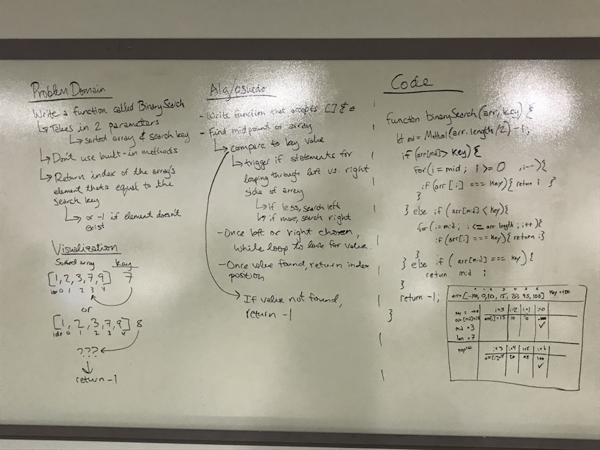

# Binary Search
Code Challenge 03 
12/19/2018
Paired on whiteboarding with Fletcher LaRue

## Challenge:
Write a function called `BinarySearch` which takes in 2 parameters: a sorted array and the search key. Without utilizing any of the built-in methods available to your language, return the index of the array’s element that is equal to the search key, or -1 if the element does not exist.

## Approach & Efficiancy
- Fletcher and I began by definining the problem domain.
- We then mapped out our visual so we could see what the desired result would be.
- Once that was done, we did some initial work on our algorithm, which fortunately stayed steady as we worked on our code, so we didn't need to make adjustments.
- After that, we started in on our code, working through it piece by piece, and adjusting our approach as needed.
- Once we reached a solution we were happy with, we talked through it, whiteboarded it out, made some minor adjustments, and then decided to move forward and test our code on our computers.
- Glory be! It worked on the first try! We had a couple of typos/linter errors.
- We then set out to work on our assignment/tests individually.

The photo in the solution below shows what we landed on together.

## Solution
