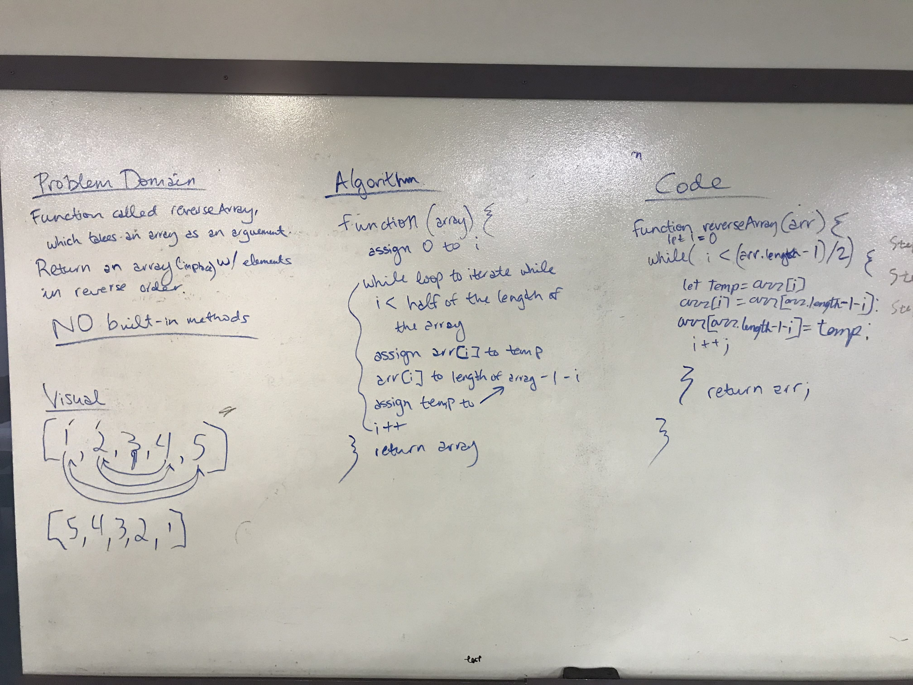

# Reverse an Array
Code Challenge 01 
12/17/2018
Paired on whiteboarding with Jared Pattison

## Challenge:
Write a function called reverseArray which takes an array as an argument. Without utilizing any of the built-in methods available to your language, return an array with elements in reversed order.

## Approach & Efficiancy
- Jared and I began by definining the problem domain. This was largely provided by the Canvas assignment, but we needed to decide if we wanted to mutate our array or return a new one and leave the original unmuttable. We decided to mutate the original array.
- We then mapped out our visual and figured out how we would need to move the numbers through the array to get the desired results.
- Once that was done, we did some initial work on our algorithm, which we revisted a few times as we worked on our code, and adjusted as needed.
- After we had that mapped out, we started in on our code, working through it piece by piece, and adjusting our approach as needed.
- We worked collaboratively to reach a solution we both felt confident in and then set out to try coding it up on our own. 

The photo in the solution below shows what we landed on together.

## Solution

