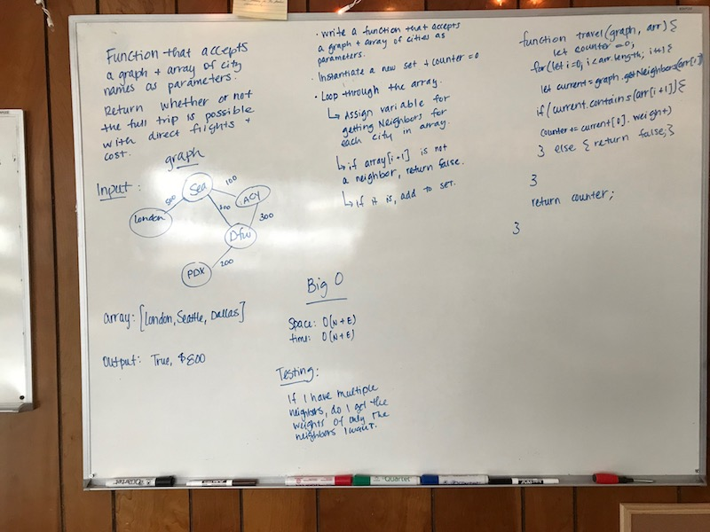

# Find Edges
Given a business trip itinerary, and an Alaska Airlines route map, is the trip possible with direct flights? If so, how much will the total trip cost be?

## Challenge
Write a function based on the specifications above, which takes in a graph, and an array of city names. Without utilizing any of the built-in methods available to your language, return whether the full trip is possible with direct flights, and how much it would cost.

## Approach & Efficiency
We attempted this using a for loop, conditionals, and the getNeighbors() method from our graph class. 

Unfortunately, I wasn't able to get this completely flushed out since I'm running into issues accessing the properties I want, but I think it's on the right track!

If this were to work as expected, it would be O(n) since it's dependent on the number of items in the array and the graph.

## Solution
Paired with Heather Cherewaty
