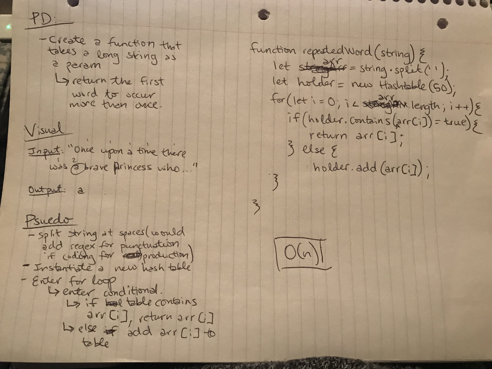

# First repeated word
Find the first repeated word in a book.

## Challenge
Write a function that accepts a lengthy string parameter. Without utilizing any of the built-in library methods available to your language, return the first word to occur more than once in that provided string.

## Approach & Efficiency
I decided to utilize a for loop and a hashtable for this challenge. 
- The function takes in a string, then splits the string, and instantiates a hashtable.
- Then a for loop is used to traverse the array and add values to the hashtable
- If the array value is already in the hashtable, it will be returned and the loop will end
- If the array contains no duplicates, 'no duplicates' will be returned

I believe this solution is O(n) since it utilizes a forLoop based on the length of the array, which will vary based on the string provided.

## Solution
