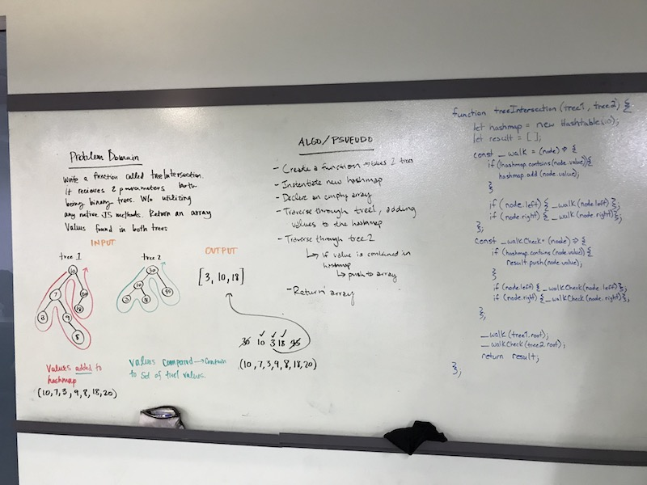

# Intersection of binary trees
Find common values in 2 binary trees.

## Challenge
Write a function called tree_intersection that takes two binary tree parameters. Without utilizing any of the built-in library methods available to your language, return a set of values found in both trees.

## Approach & Efficiency
We decided to traverse through the first tree and push each value into a hashtable. Then, we traversed through the second tree and checked if the values were contained in the hashmap. If they were, they were pushed to an array, which was returned after both trees were traversed.

The efficiency O(n) for space and time

## Solution
