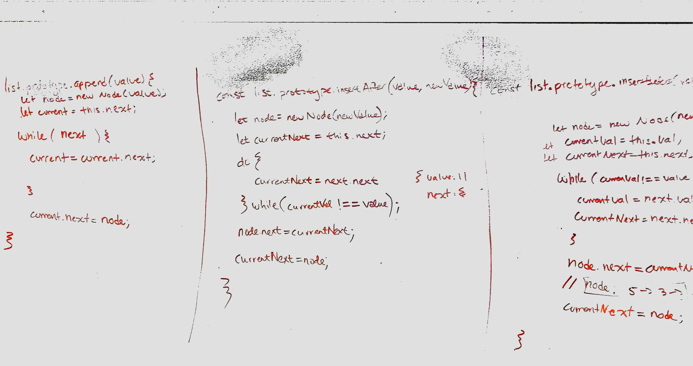
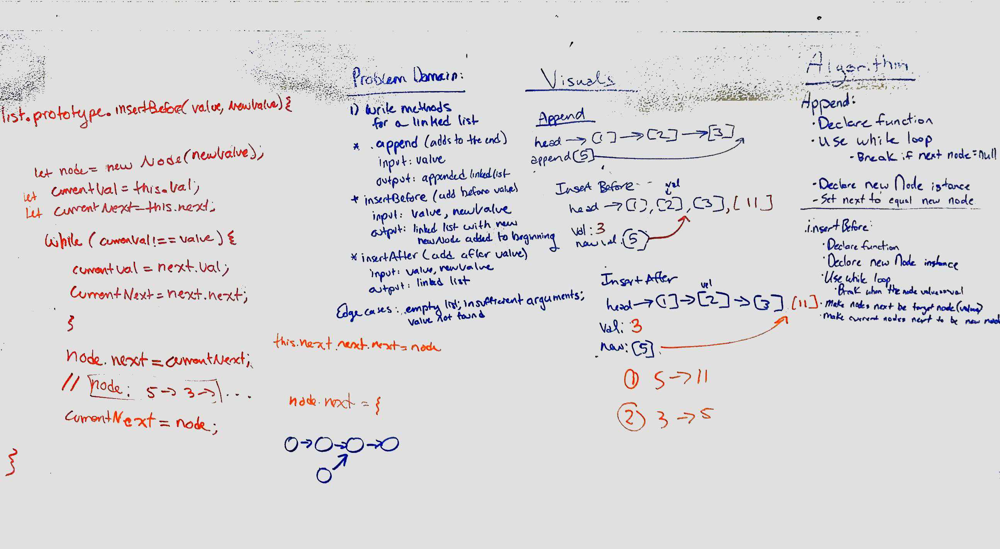
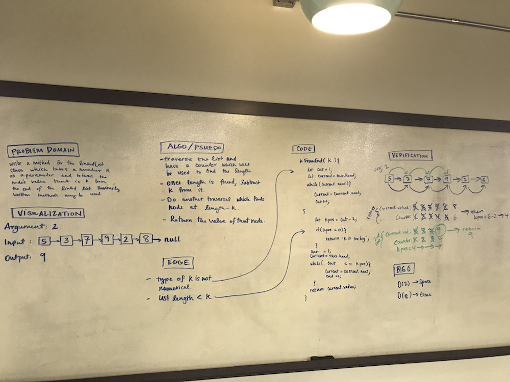
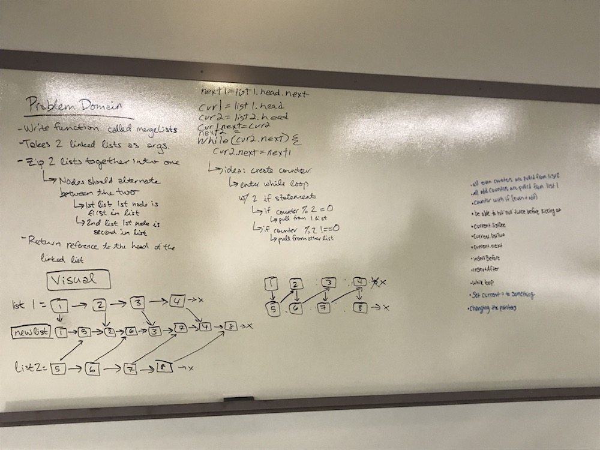

# Singly Linked List - Data Structures Lab
Using methods learned in class and in readings, create a linked list and corresponding functionality

## Challenge
- Create a Node class that has properties for the value stored in the Node, and a pointer to the next Node.
- Within your LinkedList class, include a head property. Upon instantiation, an empty Linked List should be created.
- This object should be aware of a default empty value assigned to head when the linked list is instantiated.
- Define a method called insert which takes any value as an argument and adds a new node with that value to the head of the list with an O(1) Time performance.
- Define a method called includes which takes any value as an argument and returns a boolean result depending on whether that value exists as a Node’s value somewhere within the list.
- Define a method called print which takes in no arguments and outputs all of the current Node values in the Linked List.
- At no time should an exception or stack trace be shown to the end user. - Catch and handle any such exceptions and return a printed value or operation which cleanly represents the state and either stops execution cleanly, or provides the user with clear direction and output.
- Be sure to follow your language/frameworks standard naming conventions.
- Write at least three test assertions for each method that you define.

## Approach & Efficiency
I began by reviewing my lecture notes and other resources to get a lay of the land for the concepts around linked lists, since they're a new concept. After that, I went through each item in the challenge and coded it, console logging along the way to ensure things were working as expected. I then spent time writing tests for each method, and updated my original code as needed based on my test assertions. I ran into some issues with my print method after testing and was able to revisit my code and rewrite that method. So the testing paid off!

I believe this code has an O(1) time performance

## API
- `insert(value)` allows you to add a new item to the linked list
- `includes(value)` allows you to discover if an item exists in the linked list
- `print()` allows you to see each item included in the linked list

# Linked List Insertions - Code Challenge 8
Linked list insertions. Paired with Hannah Ingham and Brent Woodward.

## Challenge
Write the following methods for the Linked List class:

- `.append(value)` which adds a new node with the given value to the end of the list
- `.insertBefore(value, newVal)` which add a new node with the given newValue immediately before the first value node
- `.insertAfter(value, newVal)` which add a new node with the given newValue immediately after the first value node
- You have access to the Node class and all the properties on the Linked List class.

## Approach & Efficiency
- We started by outlining the problem domain and drawing visualizations of how the list would change with each method.
- Then we began to work on algorithms, but found we needed to do more psuedocoding than we originally thought, so we worked through psuedocoding and brainstorming, then wrote the algorithm and code in tandem
- Once that was done we coded things up, had a number of problems, but helped each other through it as a group.
- Once our methods were working we wrote our tests!

## Solution

# Merge Linked List - Code Challenge 7
Continuation of the linked lists repo, paired with Caity Heath.

## Challenge
Write a method for the Linked List class which takes a number, k, as a parameter. Return the node’s value that is k from the end of the linked list. You have access to the Node class and all the properties on the Linked List class as well as the methods created in previous challenges.

Write at least three test assertions for each method that you define.

## Approach & Efficiency
- We started by outlining the problem domain and drawing out visualization of the input and output.
- Then we mapped out our algorithm and defined edge cases.
- We then moved onto our code, and then verification
- We handled verification a little differently than doing the standard truth table, but it was super helpful for figuring out a few minor updates with our code, which we made on the board.
- After that, we typed up our code and wrote our tests!

## Solution

# kth from the end of a Linked List - Code Challenge 8
Continuation of the linked lists repo, paired with Siobhan Niess, Jared Pattison, and some extra help from Jake Anderson and Caity Heath.

## Challenge
Write a function called mergeLists which takes two linked lists as arguments. Zip the two linked lists together into one so that the nodes alternate between the two lists and return a reference to the head of the zipped list. Try and keep additional space down to O(1). You have access to the Node class and all the properties on the Linked List class as well as the methods created in previous challenges.

Write at least three test assertions for each method that you define.

## Approach & Efficiency
- We started by outlining the problem domain and drawing out visualization of the input and output.
- Then we started to map out our algorithm.
- We time boxed ourselves to about an hour on the whiteboard and ran out of time so we decided to move onto coding things on our own.
- After spending some time working with the ideas we had laid out, I got really stuck and decided to check in with a classmate, Jake, to see if he could help me understand the problem. His explanation was super helpful and made me realize we were over-complicating our attempt.
- Once I got the code going after Jake's advice, I started writing some tests. I wasn't able to get my test working the way I was expecting, but I was tight on time, so I decided to call it for the day. Happy to have understood the solution, and hoping to revisit testing in the future.

## Solution

