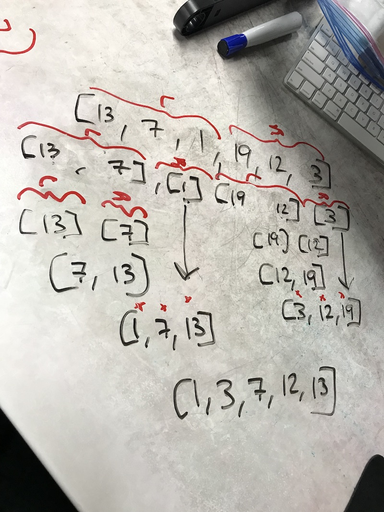

# Mergesort
Implement Mergesort.

## Challenge
Write a function that accepts an array of unsorted integers, and returns a sorted array by a recursive mergesort algorithm.

## Approach & Efficiency
We referenced [this article](https://medium.com/techtrument/implementing-merge-sort-in-javascript-898d5f54a234) for the code and then worked through it to figure out how the code was working to solve this problem.

## Solution
