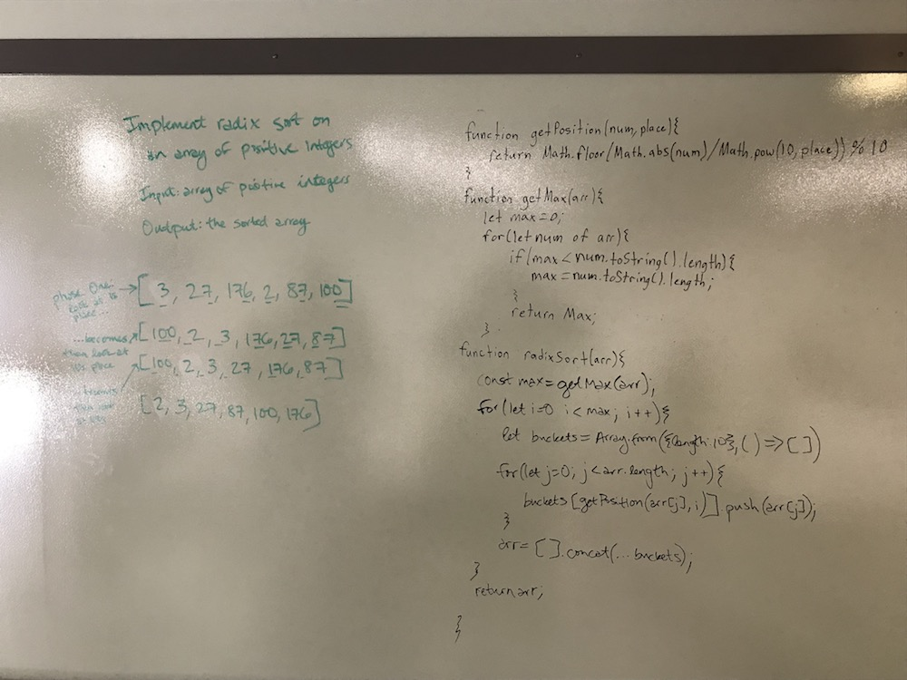
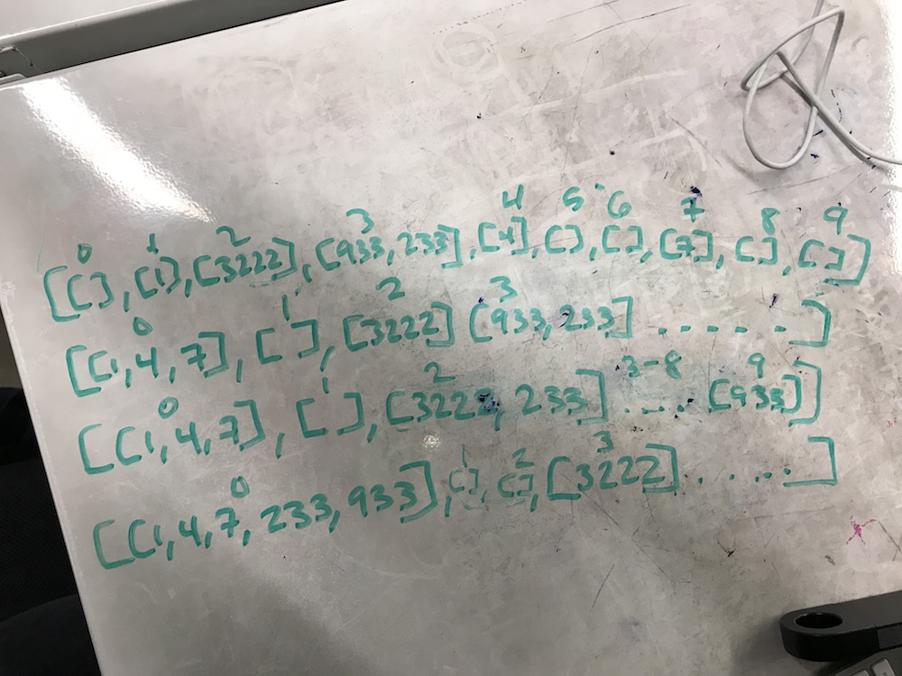

# Quicksort
Implement radix sort.

## Challenge
Write a function that accepts an array of positive integers, and returns an array sorted by a radix sort algorithm.

## Approach & Efficiency
We heavily referenced a tutorial we found online (https://reactgo.com/radix-sort-algorithm-javascript/), and then worked through the code with comments, console logs, and whiteboarding to make sense of it.

## Solution

