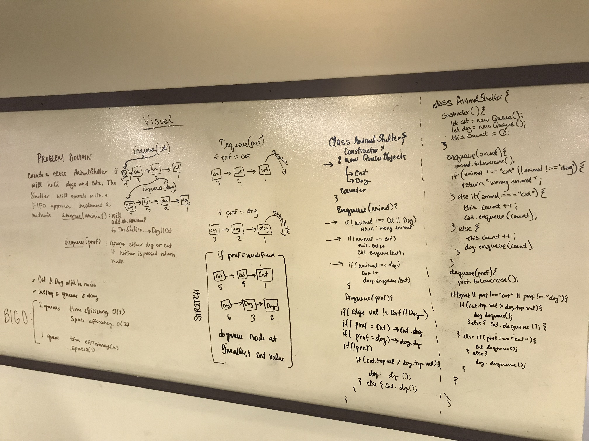

# First-In-First-Out Animal Shelter

## Authors: Caity Heath and Becca Lee

## Challenge
Write a class called AnimalShelter it will hold cats and dogs. The shelter will operate from a FIFO approach. Implement 2 methods 
* enqueue(animal)   -> will add and animal to the dog or cat queue
* dequeue(preference) -> will remove an animal from the dog and cat queue

Cat and Dog items will be nodes. Utilizing 2 queues is okay. 

## Approach & Efficiency

There are two approaches to this problem available. 

Utilizing 1 queue is more space efficient but less time efficient.  
* O(1) : space
* O(n) : time

Utilizing 2 queues is more time efficient but less space efficient.
* O(1) : time
* O(2) : space

We decided to solve this problem from a time efficient standpoint as that is what most clients are primarily concerned with. 

---

Parameters of the constructor: 
* cat queue object
* dog queue object
* counter which is the value assigned to each node enqueued on either cat or dog queue object. 

Our <strong> enque </strong> method takes in an animal parameter, after normalizing the argument it will enqueue the animal to either the cat or dog queue. If the input is neither cat or dog it will return an error message. 

Our <strong> deque </strong> method takes in a preference which indicates which queue to remove a node from. If there isn't a preference parameter, the method will remove the node with the smallest value (this obeys the FIFO approach). 

## Solution

## Setup 

` npm i   ` to install node packages. 

## Test 

` jest fifo-animal-shelter.test.js`

Will run the tests available to the AnimalShelter class. 