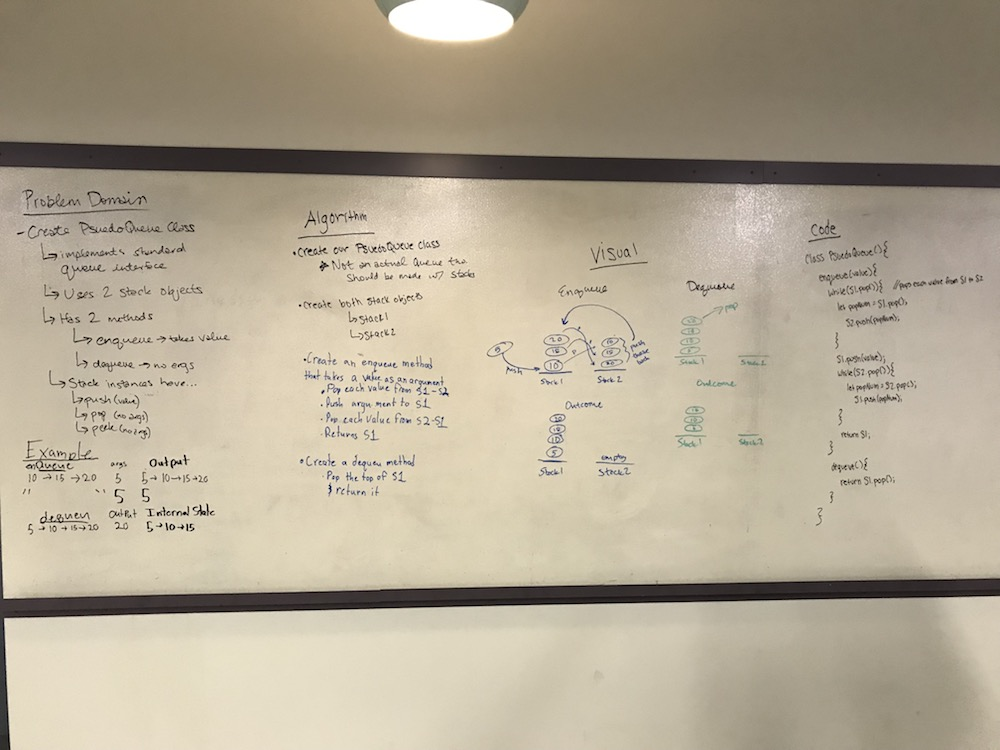

# Implement a Queue using two Stacks.
Implement a Queue using two Stacks.

## Challenge
Utilize the Single-responsibility principle: any methods you write should be clean, reusable, abstract component parts to the whole challenge. You will be given feedback and marked down if you attempt to define a large, complex algorithm in one function definition.

Write at least three test assertions for each method that you define.

Ensure your tests are passing before you submit your solution.

## Approach & Efficiency
- We started by writing out the problem domain and identifying the inputs and outputs
- Then we started on the algorithm, but realized we needed to do some more visualization to give us clarity.
- We then drew some visuals, which clarified our approach, and finished up our algorithm.
- After that, we coded out our solution and set out to code things up.
- I got mine coded, but encountered an infinite loop. I tried a couple of things to fix it, but didn't have luck. For time's sake, I'm moving on without writing tests, but I'd like to revisit if I have time and get things working properly.

## Solution
