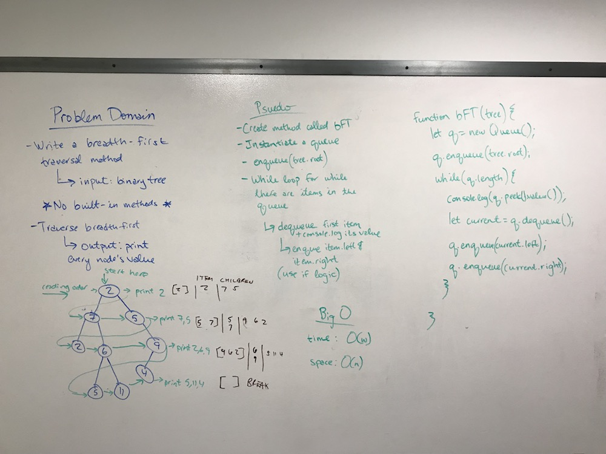
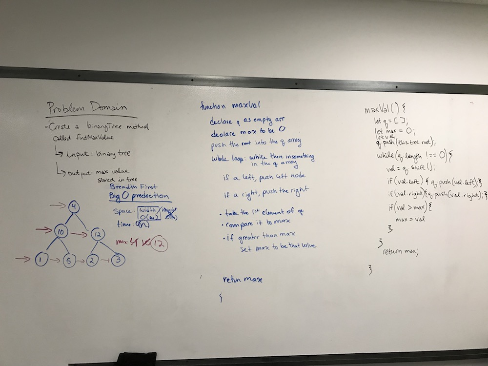

# Trees
Implement a tree

## Challenge
- Create a Node class that has properties for the value stored in the node, the left child node, and the right child node.
- Create a BinaryTree class
  - Define a method for each of the depth first traversals called preOrder, inOrder, and postOrder which returns an array of the values, ordered appropriately.

- Create a BinarySearchTree class
  - Define a method named add that accepts a value, and adds a new node with that value in the correct location in the binary search tree.
  - Define a method named contains that accepts a value, and returns a boolean indicating whether or not the value is in the tree at least once.

## Approach & Efficiency
For the BinaryTree methods, I worked primarily off of our class demo, which explained the concepts very well! For the BinarySearchTree class, I ended up needing to do some internet research, which I was then able to play with to figure out my resulting methods. Definitely took some trial and error!

## API
#### BinaryTree Class
- `preOrder` traverses through the tree, pushing node values into an array as it visits them. It traverses through the tree from root, to left, to right.
- `inOrder` traverses through the tree, pushing node values into an array as it leaves them. It traverses through the tree from left, to root, to right
- `postOrder` traverses through the tree, pushing node values into an array working from left, to right, to root
#### BinarySearchTree Class
- `add(value)` adds nodes to the tree in order. It will always set the first node added as the root, and will place nodes of lesser value to the left and nodes of greater value to the right. This is also true of nodes on either side of the root (values less than the root right node will be added to the left, greater than will be added to the right, and so on).
- `contains(value)` searches the tree for the provided value, and returns a boolean value- true if the value is in the tree, false if it isn't.

## Acknowledgement:
- heavily referenced this article to understand the code for the add(value) function: https://khan4019.github.io/front-end-Interview-Questions/bst.html

# Code Challenge 17: Breadth-first
Breadth-first Traversal.

## Challenge
Write a breadth first traversal method which takes a Binary Tree as its unique input. Without utilizing any of the built-in methods available to your language, traverse the input tree using a Breadth-first approach; print every visited node’s value.

## Approach & Efficiency
- We remembered that John had mentioned using a while loop and queues in class, so we decided to take that approach. We needed to do a lot of talking and sketching to get our heads around it, but then landed on what felt like a good approach. The code is not yet fully operational, but I don't think it's too far off.
- The big O for our approach is a time of O(w) and a space of O(n)

## Solution

# Code Challenge 18: Breadth-first
Find the Maximum Value in a Binary Tree

## Challenge
Write a function called find-maximum-value which takes binary tree as its only input. Without utilizing any of the built-in methods available to your language, return the maximum value stored in the tree. You can assume that the values stored in the Binary Tree will be numeric.

## Approach & Efficiency
- Since we are getting used to breadth-first traversal, we decided to approach this problem with a breadth-first traversal method that pushes values into an array and resets the max variable to the highest value found using a comparison method.
- The big O for our approach is a time of O(w) and a space of O(n)

## Solution
